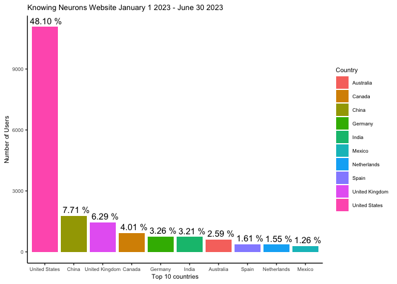
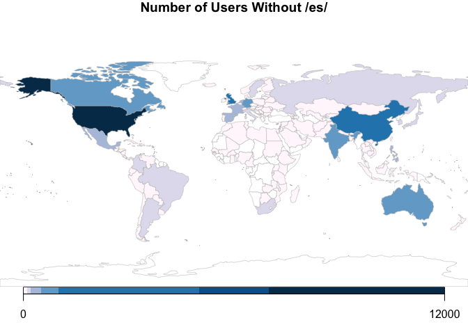
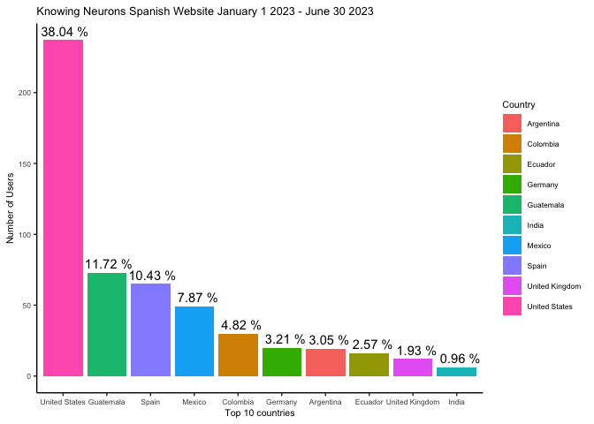
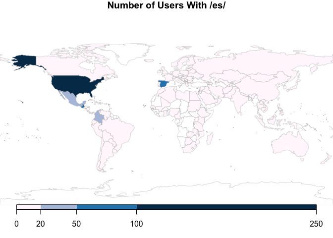
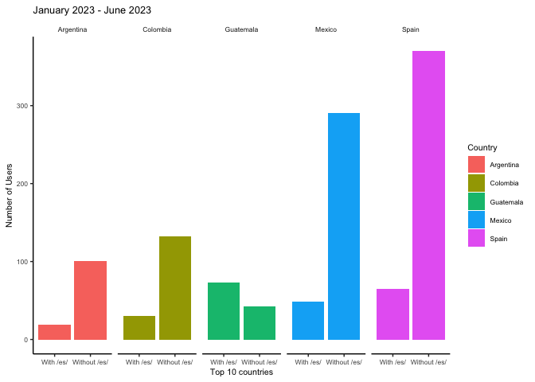
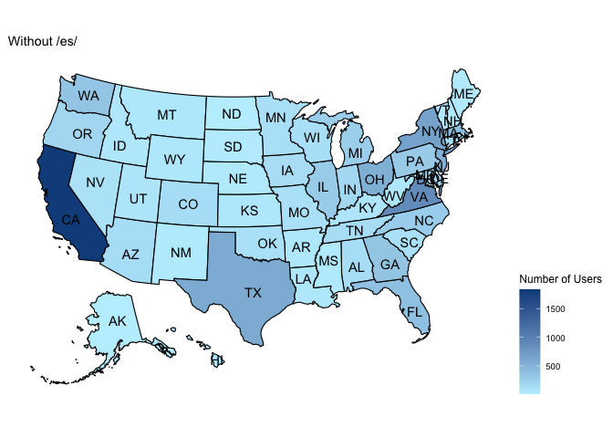
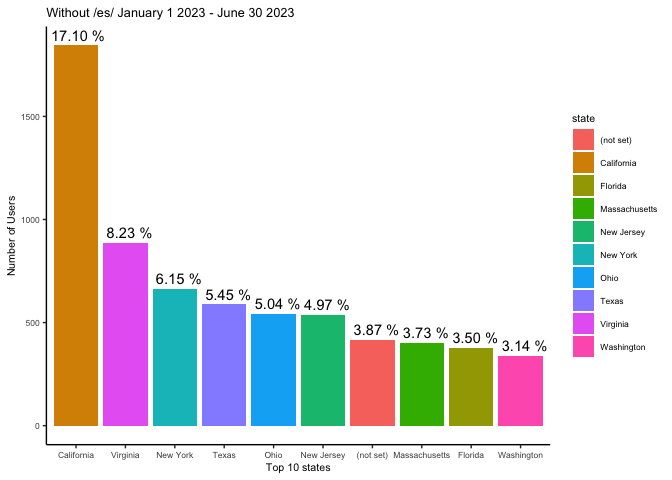
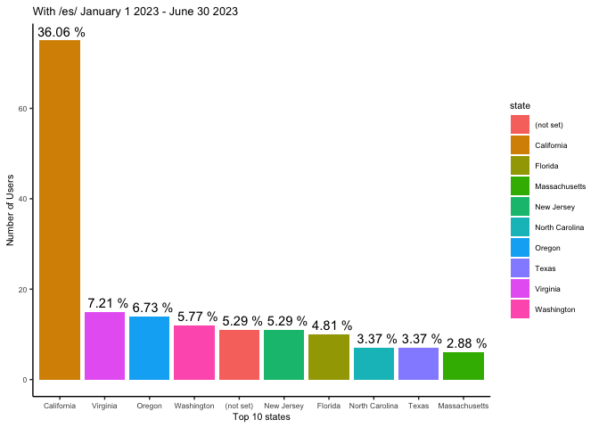

Knowing Neurons Users
================
Peris-Yague et al. 2023
17/6/2023

Shield: [![CC BY-NC-SA 4.0][cc-by-nc-sa-shield]][cc-by-nc-sa]

This work is licensed under a
[Creative Commons Attribution-NonCommercial-ShareAlike 4.0 International License][cc-by-nc-sa].

[![CC BY-NC-SA 4.0][cc-by-nc-sa-image]][cc-by-nc-sa]

[cc-by-nc-sa]: http://creativecommons.org/licenses/by-nc-sa/4.0/
[cc-by-nc-sa-image]: https://licensebuttons.net/l/by-nc-sa/4.0/88x31.png
[cc-by-nc-sa-shield]: https://img.shields.io/badge/License-CC%20BY--NC--SA%204.0-lightgrey.svg

  - [The Translation Project](#the-translation-project)
  - [General data](#general-data)
  - [English Site](#english-site)
  - [Spanish Site](#spanish-site)
  - [Comparison of the Spanish-speaking top 10
    countries](#comparison-of-the-spanish-speaking-top-10-countries)
  - [USA users January 1 2023 - June 30 2023 (since /es/ launch
    readership)](#usa-users-january-1-2023---june-30-2023-since-es-launch-readership)

# The Translation Project

All data was acquired from January 1st - June 30th 2023.

# General data

If you’d like to take a look at the general data you can find it in the
file: data\_20230101-20230630.csv

    ##         Country                 Date.Range      Segment Users
    ## 1 United States Jan 1, 2023 - Jun 30, 2023    All Users 11238
    ## 2 United States Jan 1, 2023 - Jun 30, 2023    With /es/   237
    ## 3 United States Jan 1, 2023 - Jun 30, 2023 Without /es/ 11072
    ## 4         China Jan 1, 2023 - Jun 30, 2023    All Users  1775
    ## 5         China Jan 1, 2023 - Jun 30, 2023    With /es/     2
    ## 6         China Jan 1, 2023 - Jun 30, 2023 Without /es/  1774

# English Site

We can now filter the data to only the English site i.e. without the tag
‘/es/’. And do a barplot and a world map plot of what the user profiles
looks like

    ##          Country                 Date.Range      Segment Users
    ## 1  United States Jan 1, 2023 - Jun 30, 2023 Without /es/ 11072
    ## 2          China Jan 1, 2023 - Jun 30, 2023 Without /es/  1774
    ## 3 United Kingdom Jan 1, 2023 - Jun 30, 2023 Without /es/  1448
    ## 4         Canada Jan 1, 2023 - Jun 30, 2023 Without /es/   923
    ## 5        Germany Jan 1, 2023 - Jun 30, 2023 Without /es/   750
    ## 6          India Jan 1, 2023 - Jun 30, 2023 Without /es/   739

<!-- -->

    ## 142 codes from your data successfully matched countries in the map
    ## 15 codes from your data failed to match with a country code in the map
    ##       failedCodes failedCountries        
    ##  [1,] NA          "Total"                
    ##  [2,] NA          "Türkiye"              
    ##  [3,] NA          "(not set)"            
    ##  [4,] NA          "Czechia"              
    ##  [5,] NA          "North Macedonia"      
    ##  [6,] NA          "Bosnia & Herzegovina" 
    ##  [7,] NA          "Myanmar (Burma)"      
    ##  [8,] NA          "U.S. Virgin Islands"  
    ##  [9,] NA          "Curaçao"              
    ## [10,] NA          "Réunion"              
    ## [11,] NA          "Trinidad & Tobago"    
    ## [12,] NA          "Antigua & Barbuda"    
    ## [13,] NA          "Caribbean Netherlands"
    ## [14,] NA          "Côte d’Ivoire"        
    ## [15,] "MTQ"       "Martinique"           
    ## 101 codes from the map weren't represented in your data

<!-- -->

# Spanish Site

We can now filter the data to only the Spanish site i.e. with the tag
‘/es/’. And do a barplot and a world map plot of what the user
profiles looks like

    ##          Country                 Date.Range   Segment Users
    ## 1  United States Jan 1, 2023 - Jun 30, 2023 With /es/   237
    ## 2          China Jan 1, 2023 - Jun 30, 2023 With /es/     2
    ## 3 United Kingdom Jan 1, 2023 - Jun 30, 2023 With /es/    12
    ## 4         Canada Jan 1, 2023 - Jun 30, 2023 With /es/     4
    ## 5        Germany Jan 1, 2023 - Jun 30, 2023 With /es/    20
    ## 6          India Jan 1, 2023 - Jun 30, 2023 With /es/     6

<!-- -->

    ## 142 codes from your data successfully matched countries in the map
    ## 15 codes from your data failed to match with a country code in the map
    ##       failedCodes failedCountries        
    ##  [1,] NA          "Total"                
    ##  [2,] NA          "Türkiye"              
    ##  [3,] NA          "North Macedonia"      
    ##  [4,] NA          "U.S. Virgin Islands"  
    ##  [5,] NA          "(not set)"            
    ##  [6,] NA          "Czechia"              
    ##  [7,] NA          "Bosnia & Herzegovina" 
    ##  [8,] NA          "Myanmar (Burma)"      
    ##  [9,] NA          "Curaçao"              
    ## [10,] NA          "Réunion"              
    ## [11,] NA          "Trinidad & Tobago"    
    ## [12,] NA          "Antigua & Barbuda"    
    ## [13,] NA          "Caribbean Netherlands"
    ## [14,] NA          "Côte d’Ivoire"        
    ## [15,] "MTQ"       "Martinique"           
    ## 101 codes from the map weren't represented in your data

<!-- -->

# Comparison of the Spanish-speaking top 10 countries

Now we can compare from the Spanish top 10 readership countries, those
that are Spanish speaking, with their amount of users in the US site.

<!-- -->

# USA users January 1 2023 - June 30 2023 (since /es/ launch readership)

Now we can look at the users profile across different states in the
United States separating the Spanish and English domains as well as plot
the top 10 states that show the majority of users.

    ##        state                       when         segment users
    ## 1 California Jan 1, 2023 - Jun 30, 2023       All Users  1886
    ## 2 California Jan 1, 2023 - Jun 30, 2023 Spanish Website    75
    ## 3 California Jan 1, 2023 - Jun 30, 2023    Without /es/  1844
    ## 4   Virginia Jan 1, 2023 - Jun 30, 2023       All Users   899
    ## 5   Virginia Jan 1, 2023 - Jun 30, 2023 Spanish Website    15
    ## 6   Virginia Jan 1, 2023 - Jun 30, 2023    Without /es/   887

<!-- --><!-- --><!-- --><!-- -->

